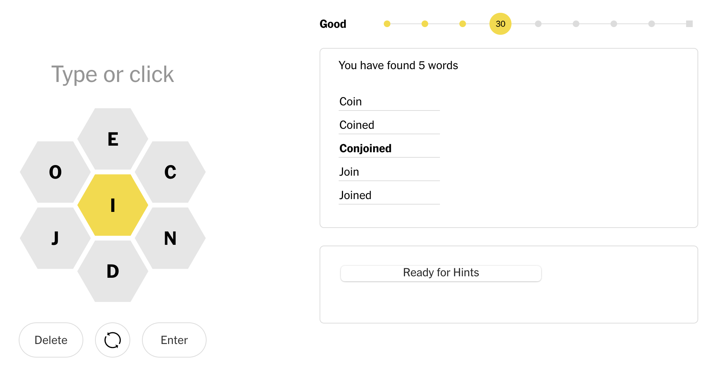
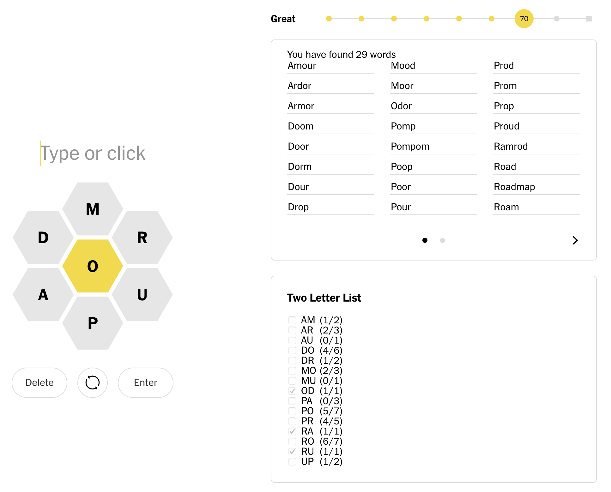

# Methodical Spelling Bee

Browser extension that tracks your progress on towards each hint for today's [NY Times Spelling Bee](https://www.nytimes.com/puzzles/spelling-bee). It doesn't show the hints until you're ready for them.

## Setup

1. `nvm install --lts`
1. `npm install --global web-ext`
1. Clone this repo and `cd` to it
1. `npm install`

## Development

1. `cd dev`
1. `web-ext run --watch-file=app.bundle.js & npm start`

The `--watch-file` argument is needed so that web-ext doesn't reload before the `watch` task finished each build. See https://github.com/mozilla/web-ext/issues/1626

Use `Add --firefox=firefoxdeveloperedition` to the `web-ext` command if you're using Firefox Dev Edition.
Add [the `--firefox-profile` option](https://extensionworkshop.com/documentation/develop/getting-started-with-web-ext/) if you want to use a specific profile.

Run `web-ext lint` in the `build` folder periodically to check for warnings, and fix them.

This is based on https://github.com/VasilyShelkov/create-react-extension, so it has a lot of extra files that're required to build, but not actually used. They've been made empty.

## Distributing

1. `npm run build`
1. TBD

## Notes

It's a browser extension so that it can automatically pull in the words you've found, rather than you having to enter them into the app.
