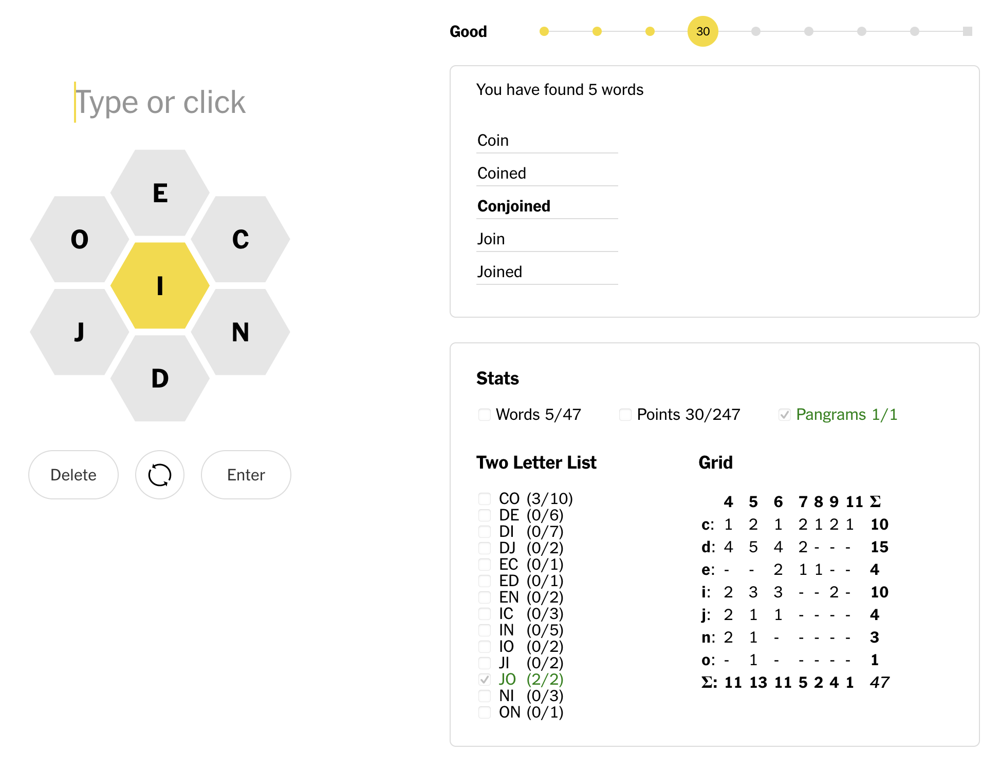

# Methodical Spelling Bee

Browser extension that tracks your progress on towards each hint for today's [NY Times Spelling Bee](https://www.nytimes.com/puzzles/spelling-bee). It doesn't show the hints until you're ready for them.

## Development

`cd dev && web-ext run & npm start`

Use `web-ext run --firefox=firefoxdeveloperedition` if you're using Firefox Dev Edition. Add [the `--firefox-profile` option](https://extensionworkshop.com/documentation/develop/getting-started-with-web-ext/) if you want to use a specific profile.

Run `web-ext lint` periodically.

This is based on https://github.com/VasilyShelkov/create-react-extension, so it has a lot of extra files that're required to build, but not actually used. They've been made empty.

Run `npm build` before

## Notes

It's a browser extension so it can pull the words you've automatically, instead of having to enter them into another app.
